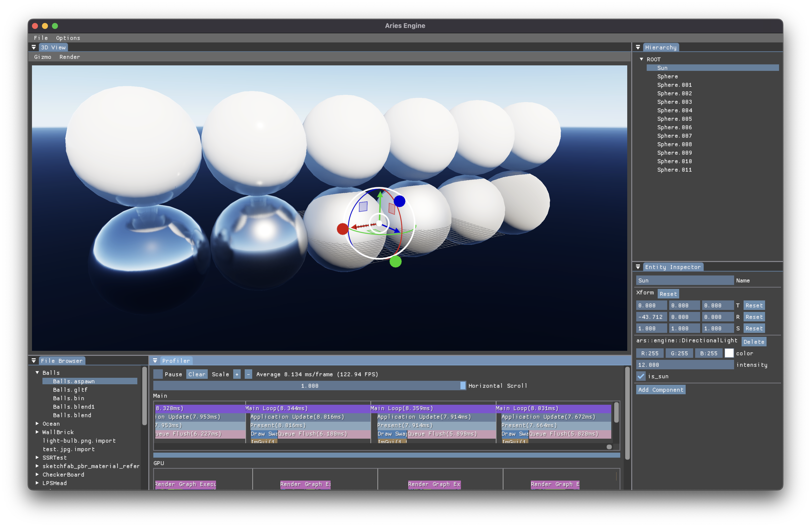

# Aries

My toy Vulkan renderer. Runs on macOS/Linux/Windows.

> WARNING: very early stage of development, everything is going to change.
> 
> See [TODO](TODO.md) for current existing and work in progress features.

## Build

You need [frill](https://github.com/huisedenanhai/frill) built first, and configure cmake
with `-DARS_FRILL_EXECUTABLE=<path-to-frill-exe>`

Compilers should be clang or MSVC.

## Run

1. Create a folder and put your assets in there. It will be your project folder.
2. Run `aries_importer` with cwd set to the project folder. It will import all your assets to a subdirectory `.ars/`
3. Run `aries_editor` with cwd set to the project folder.

> The only thing can be done for now is double click to open a gltf or aspawn file, edit and save it as an aspawn.
>
> Those aspawn files reference imported data, the imported data format may change and those aspawn might be broken, thus
> for now the editor is no more than a fancy gltf viewer, with many limitations :(
>
> I only use seperated gltf, and mesh tangent data must be included.

> Executables in playground may not always runnable.
> 
> They are there for quick and dirty test of work in progress features, and will be removed as soon as those features are easily reachable from editor or launcher.
